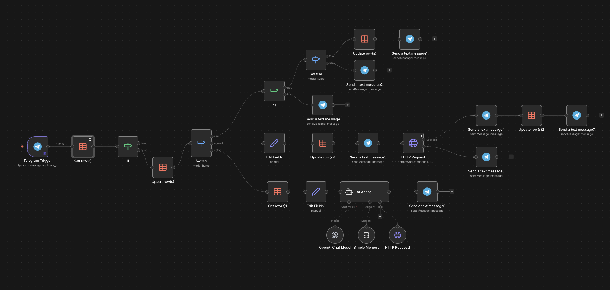
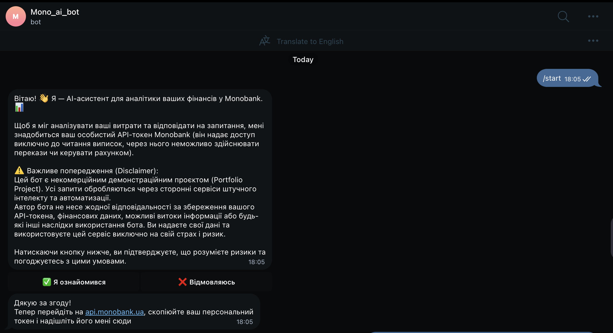
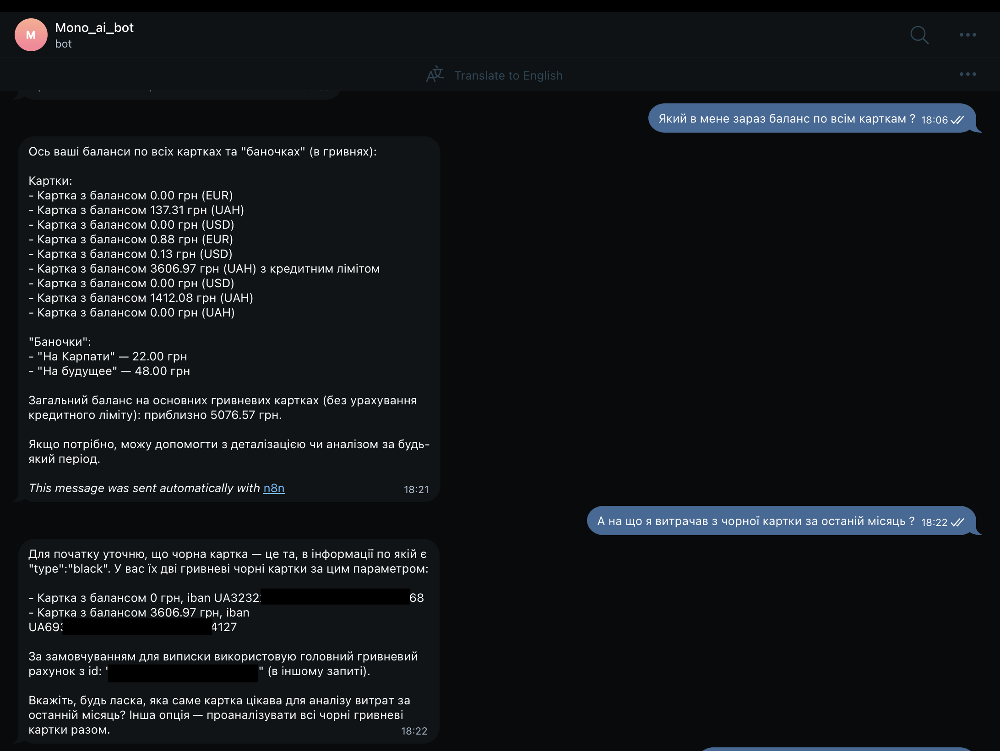
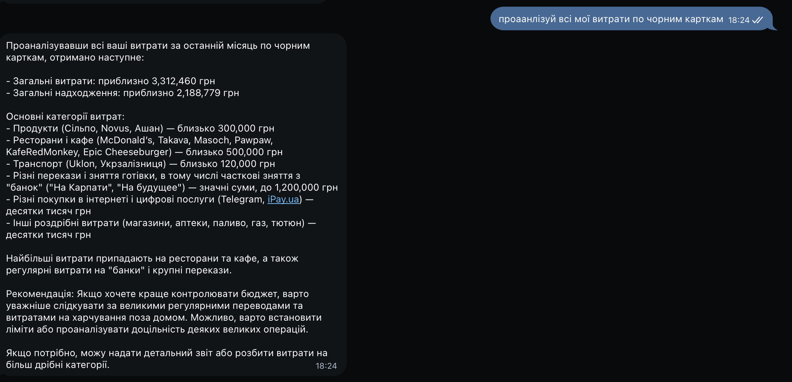

# 🤖 Monobank AI Financial Analyst (n8n + OpenAI)

AI-асистент у Telegram, який підключається до особистого рахунку Monobank через API та проводить глибоку аналітику витрат за допомогою природної мови. 

Проєкт демонструє побудову AI-агентів з використанням зовнішніх інструментів (Function Calling / Tools), управління станами користувачів (State Management) та безпечну роботу з фінансовими API у середовищі **n8n**.

## ✨ Головні фічі
* **AI-Аналітика:** Користувач може запитати "Скільки я витратив на таксі цього місяця?" або "Проаналізуй мої витрати за вихідні", і ШІ самостійно формує запит до банку.
* **Smart Tooling:** AI Agent динамічно конвертує природну мову в UNIX-таймстемпи для формування коректних `GET`-запитів до API Monobank.
* **State Management:** Реалізовано повноцінний флоу онбордингу користувача (New -> Agreed -> Active) із захистом даних.
* **Безпека:** Бот працює лише з токенами доступу "Тільки для читання" (Personal API), без можливості переказу коштів.

## 🏗 Архітектура рішення

1. **Telegram Trigger:** Приймає повідомлення та натискання інлайн-кнопок (Callback Queries).
2. **Database (State Manager):** Валідує статус користувача (перевірка згоди з політикою конфіденційності, наявність валідного API-токена).
3. **Smart Router:** Розподіляє логіку між онбордингом та AI-агентом.
4. **AI Agent (OpenAI):** - Отримує системний контекст (поточний час, часовий пояс).
   - Використовує кастомний `HTTP Request Tool` для безпечного звернення до ендпоінтів `/personal/client-info` та `/personal/statement`.
   - Обробляє JSON-відповідь банку (конвертує копійки в гривні, групує категорії) та генерує читабельний звіт у Markdown.

**

## Перевірити бота можна за посиланням (@mono_ai_fin_bot)

## 🚀 Як розгорнути у себе (Quick Start)

1. Встановіть [n8n](https://n8n.io/).
2. Створіть нового Telegram бота через BotFather та отримайте `Bot Token`.
3. Імпортуйте файл `workflow.json` у ваш робочий простір n8n.
4. Додайте ваші Credentials для Telegram та OpenAI у відповідні ноди.
5. Запустіть воркфлоу та перейдіть у вашого бота!

## 📸 Демонстрація роботи
**
**
**

## 🛠 Технологічний стек
* **Оркестрація:** n8n
* **LLM:** OpenAI (GPT-4o-mini)
* **Інтеграції:** Telegram Bot API, Monobank Open API
* **Сховище:** n8n Data Table (або PostgreSQL/Supabase)

---
*Проєкт створено Михайлом О. (@mi_s_h_a) для портфоліо як демонстрація можливостей автоматизації бізнес-процесів за допомогою AI агентів.*
